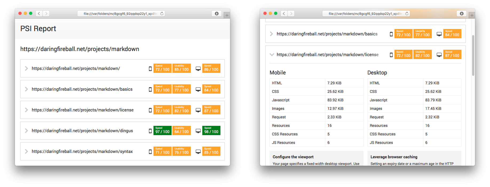

# psi-report

Crawls a website, gets [PageSpeed Insights](https://developers.google.com/speed/pagespeed/insights/) data for each page, and exports an HTML report.



---

* [Installation](#installation)
* [CLI usage](#cli-usage)
* [Programmatic usage](#programmatic-usage)
* [Crawler behavior](#crawler-behavior)
* [Changelog](#changelog)
* [License](#license)
* [Credits](#credits)

## Installation

Install with [npm](https://www.npmjs.com/):

```bash
$ npm install psi-report --global
# --global isn't required if you plan to use the node module
```

## CLI usage

```bash
$ psi-report <url> <dest_path>
```

Example:

```bash
$ psi-report daringfireball.net/projects/markdown /Users/johan/Desktop/report.html
```

## Programmatic usage

```javascript
// Basic usage: crawls a website, and returns an array of pages with their PSI results

var PSIReport = require('psi-report');
var psi_report = new PSIReport({baseurl: 'http://domain.org'}, onComplete);
reporter.start();

function onComplete(baseurl, data)
{
    console.log('Report for: ' + baseurl);
    console.log(data);
}

// The "fetch_url" and "fetch_psi" events allow to monitor the crawling process

psi_report.on('fetch_url', onFetchURL);
function onFetchURL(error, url)
{
    console.log((error ? 'Error with URL: ' : 'Fetched URL: ') + url);
}

psi_report.on('fetch_psi', onFetchPSI);
function onFetchPSI(error, url, strategy)
{
    console.log((error ? 'Error with PSI for ' : 'PSI data (' + strategy + ') fetched for ') + url);
}
```

## Crawler behavior

The base URL is used as a root when crawling the pages.

For instance, using the URL `https://daringfireball.net/` will crawl the entire website.

However, `https://daringfireball.net/projects/markdown/` will crawl only:

* `https://daringfireball.net/projects/markdown/`
* `https://daringfireball.net/projects/markdown/basics`
* `https://daringfireball.net/projects/markdown/syntax`
* `https://daringfireball.net/projects/markdown/license`
* And so on

*This may be useful to crawl only one part of a website: everything starting with `/en`, for instance.*

## Changelog

This project uses [semver](http://semver.org/).

| Version | Date | Notes |
| --- | --- | --- |
| `2.0.0` | 2016-04-02 | Deep module rewrite (New module API, updated CLI usage) |
| `1.0.1` | 2016-01-15 | Fix call on obsolete package |
| `1.0.0` | 2015-12-01 | Initial version |

## License

This project is released under the [MIT License](license.md).

## Credits

* [async](https://github.com/caolan/async)
* [colors](https://github.com/Marak/colors.js)
* [request](https://github.com/request/request)
* [crawler](https://github.com/sylvinus/node-crawler)
* [jsdom](https://github.com/tmpvar/jsdom)
* [yargs](https://github.com/bcoe/yargs)
