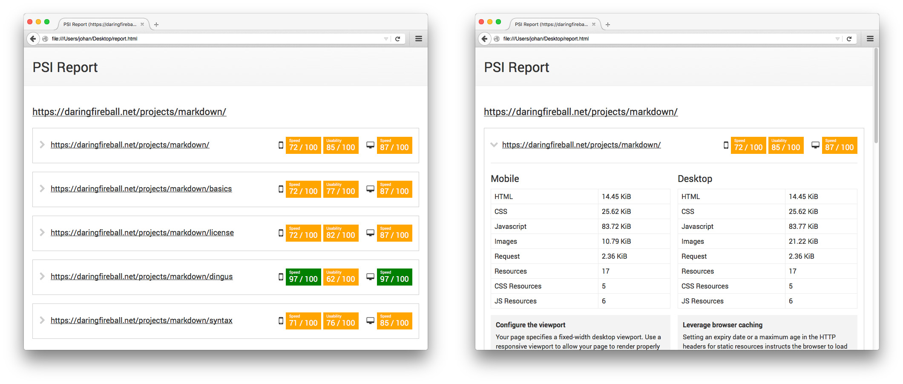

# psi-report

Crawls a website and gets [PageSpeed Insights](https://developers.google.com/speed/pagespeed/insights/) data for each page.



---

* [Installation](#installation)
* [CLI usage](#cli-usage)
* [Programmatic usage](#programmatic-usage)
* [Crawler behavior and output formats](#crawler-behavior-and-output-formats)
* [Changelog](#changelog)
* [License](#license)
* [Credits](#credits)

## Installation

Install with [npm](https://www.npmjs.com/):

```bash
npm install -g psi-report
```

## CLI usage

```bash
psi-report http://domain.org
```

### Options

##### `--format=[html|json]`

Output format (default is **html**).

##### `--stdout`

Echoes the result code instead of saving it on the disk.

##### `--silent`

Do not print information when crawling the website.

Automatically set when using the `--stdout` option.

##### `--open`

Opens the generated report in the default application. (OSX only)

## Programmatic usage

```javascript
var Reporter = require('psi-report');

var reporter = new Reporter({
    baseurl: 'http://domain.org',
    format: 'html'
});

reporter.on('complete', function(error, baseurl, data)
{
    console.log('Report for URL: ' + baseurl);
    if (error)
    {
        console.log('An error occurred: ' + error.message);
    }
    else
    {
        console.log(data); // A JSON object or a HTML string
    }
});

reporter.start();
```

## Crawler behavior and output formats

### Crawled URL

The base URL is used as a root when crawling the pages.

Let's consider those two examples:

```bash
psi-report https://daringfireball.net/
```

This will crawl the entire website.

```bash
psi-report https://daringfireball.net/projects/markdown/
```

This will restrict the crawler to children pages only:

* `https://daringfireball.net/projects/markdown/` will be crawled
* `https://daringfireball.net/projects/markdown/basics` will be crawled
* `https://daringfireball.net/projects/` will be ignored
* And so on

### Output formats

Two output formats are available.

**html** will output a standalone, human-readable HTML report.

**json** will return a JSON object with the following structure:

```json
{
    "http://domain.org/page1":
    {
        "mobile":
        {
            // [...] PSI raw data for mobile strategy
        },
        "desktop":
        {
            // [...] PSI raw data for desktop strategy
        }
    },
    "http://domain.org/page2":
    {
        "mobile":
        {
            // [...]
    }
}
```

[More information about the PSI data](https://developers.google.com/speed/docs/insights/v2/reference/pagespeedapi/runpagespeed#response).

## Changelog

| Version | Date | Notes |
| --- | --- | --- |
| `1.0.0` | Novembre 22, 2015 | Initial version |

## License

This project is released under the [MIT License](LICENSE).

## Credits

* [request](https://github.com/request/request)
* [simplecrawler](https://github.com/cgiffard/node-simplecrawler)
* [async](https://github.com/caolan/async)
* [colors](https://github.com/Marak/colors.js)
* [yargs](https://github.com/bcoe/yargs)